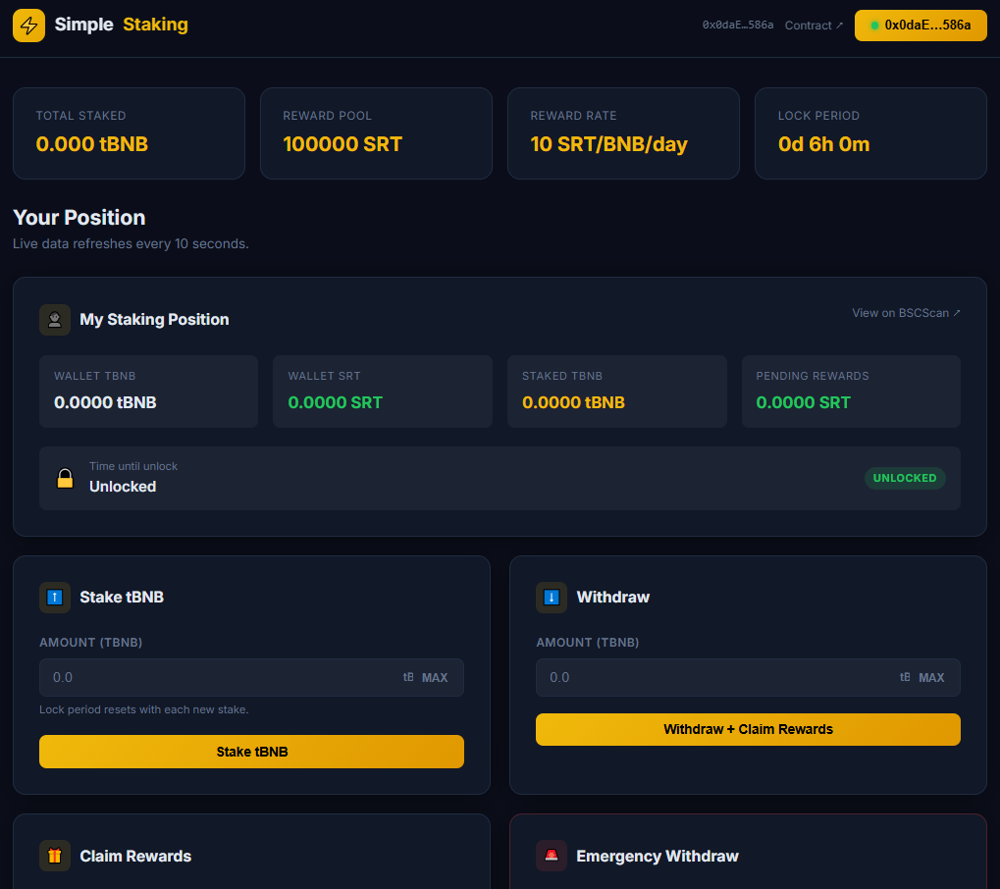

---

## Website: https://simple-staking-app-one.vercel.app/

# SimpleStaking

SimpleStaking is a BNB staking platform with:

- a production-oriented Solidity staking contract
- a browser frontend for wallet connection and staking actions
- deployment and verification scripts for BSC Testnet

The protocol lets users stake native BNB, accrue ERC-20 rewards over time, withdraw after a lock period, and claim rewards independently.

## Project Structure

```text
SimpleStaking/
├── assets/
│   └── images/
│       └── dapp-screenshot.png
├── contracts/                # Foundry smart-contract workspace
│   ├── src/
│   │   ├── Staking.sol       # Main staking logic
│   │   └── SRTToken.sol      # Reward token (SRT)
│   ├── test/
│   │   └── Staking.t.sol     # Contract tests
│   ├── script/
│   │   └── Deploy.s.sol      # Deploy and fund reward pool
│   └── foundry.toml
├── frontend/
│   ├── index.html
│   ├── css/style.css
│   └── js/
│       ├── app.js
│       └── config.js
├── .env.example
├── .gitignore
└── README.md
```

## Smart Contract Overview

`contracts/src/Staking.sol` includes:

- staking with configurable lock period
- linear reward accrual based on staked amount and elapsed time
- withdrawal with automatic reward claim
- reward-only claim flow
- emergency withdrawal path
- owner controls: pause/unpause, reward pool funding, reward/lock updates

Security-oriented modules in use:

- `ReentrancyGuard`
- `Pausable`
- `Ownable`

## Deployed Contracts (BSC Testnet)

- SRT Token: `0x316eB7De3b1B7b2Cf5C8F948bFd5059c2a76Cbc8`
- Staking: `0xa31FA4c9beF2DfF105F89FA64bA5Cc64BAcF952E`

Frontend addresses are configured in `frontend/js/config.js`.

## Prerequisites

- [Foundry](https://book.getfoundry.sh/getting-started/installation)
- Node.js (for local static hosting, optional)
- A wallet extension (MetaMask or Rabby recommended)
- Testnet BNB on BSC Testnet

## Environment Setup

Create a root `.env` file:

```env
PRIVATE_KEY="0x..."
RPC_URL="https://..."
BSCSCAN_API_KEY="..."
```

## Smart Contract Commands

From project root:

```bash
cd contracts
```

Build:

```bash
forge build
```

Run tests:

```bash
forge test
```

Coverage:

```bash
forge coverage
```

Deploy to BSC Testnet:

```bash
set -a && source ../.env && set +a
forge script script/Deploy.s.sol --rpc-url "$RPC_URL" --private-key "$PRIVATE_KEY" --broadcast
```

Verify token:

```bash
forge verify-contract <TOKEN_ADDRESS> src/SRTToken.sol:SRTToken \
  --chain 97 \
  --etherscan-api-key "$BSCSCAN_API_KEY" \
  --verifier-url "https://api.etherscan.io/v2/api?chainid=97&" \
  --constructor-args $(cast abi-encode "constructor(uint256)" 1000000000000000000000000)
```

Verify staking:

```bash
forge verify-contract <STAKING_ADDRESS> src/Staking.sol:Staking \
  --chain 97 \
  --etherscan-api-key "$BSCSCAN_API_KEY" \
  --verifier-url "https://api.etherscan.io/v2/api?chainid=97&" \
  --constructor-args $(cast abi-encode "constructor(address,uint256,uint256)" <TOKEN_ADDRESS> 10 21600)
```

## Frontend Features

- connect/disconnect wallet
- network check for BSC Testnet (chain ID 97)
- wrong-network button state with network switch flow (Not working well with metamask somehow, but works beautifully with rabby)
- stake, withdraw, claim rewards, emergency withdraw actions
- live position and protocol stats refresh
- user-friendly error parsing for common contract reverts

## Notes

- The staking lock period is currently configured via deployment script (`Deploy.s.sol`).
- Reward pool must be funded for successful reward claims.
- If wallet state appears stale after rapid network changes, refresh the page and reconnect.

## License

[](https://opensource.org/licenses/MIT)
